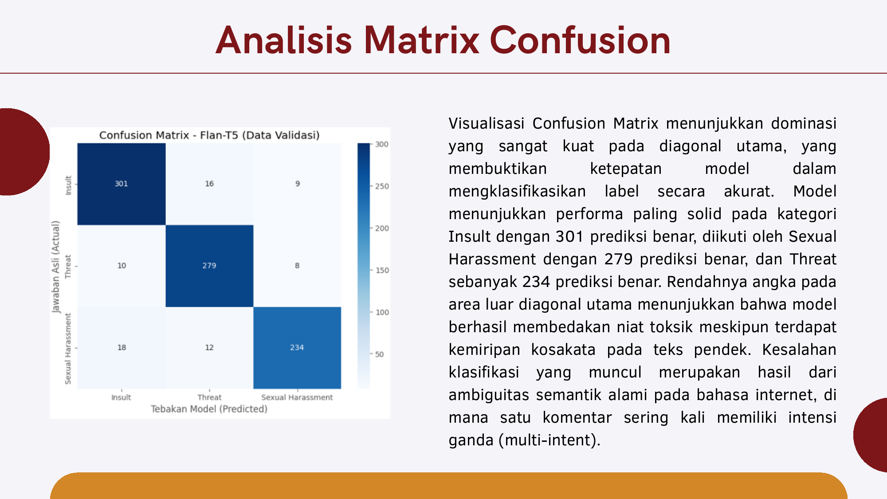
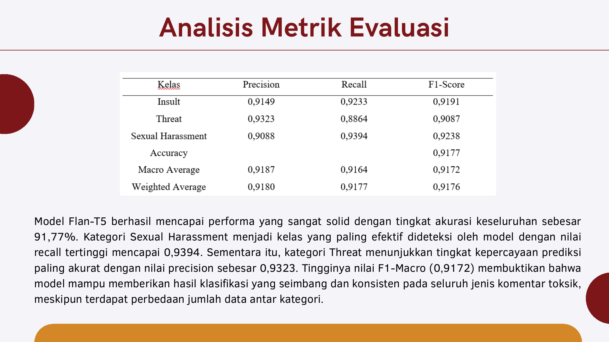

# Toxic Comment Classification with Flan-T5 Transfer Learning

> Fine-tuning Google's Flan-T5 (encoder–decoder Transformer) to detect **insults, threats, and sexual harassment** in short social-media comments — **91.77% accuracy**, **F1-Macro 0.9172**.



## Problem

Massive social-media usage produces a constant stream of toxic comments — insults, threats, and sexual harassment — that harm digital communication and users' wellbeing. Classic frequency-based approaches (Logistic Regression, SVM on TF-IDF) struggle with informal language, abbreviations, and emoji, and cannot detect *veiled* toxicity: "I'll ensure you never get that promotion" contains no profanity, yet a Transformer's self-attention correctly links "I'll ensure" + "never get" + "promotion" into an intimidation intent.

## Data

- **Source:** Toxic Comments dataset (Kaggle), 5,910 manually labeled comments ([dataset mirror](https://drive.google.com/drive/folders/1JRiQWyyCmIgAy6fyxukdyvqZCE8PO6m?usp=drive_link))
- **Classes:** Insult 2,111 (35.6%) · Threat 1,982 (33.5%) · Sexual Harassment 1,826 (30.8%)
- The mild class imbalance is why **F1-Macro** (not plain accuracy) is the headline metric
- EDA: most comments are 4–9 words long, all under ~20 words → `max_length=128` covers 100% of observations

## Approach

1. **Preprocessing** — duplicate removal, missing-text handling, and **demojize**: emoji converted to descriptive text (`:pile_of_poo:`, `:enraged_face:`) so the model keeps the emotional signal
2. **Prompt engineering** — every comment is prefixed with the instruction `"Classify this comment as insult, threat, or sexual harassment: "` (text-to-text framing)
3. **Fine-tuning Flan-T5** — 85/15 stratified split, AdamW, 5 epochs (validation-loss convergence), label padding masked with −100, best checkpoint kept via `load_best_model_at_end`
4. **Evaluation** — F1-Macro, per-class precision/recall, confusion matrix, qualitative error analysis

## Results

| Metric | Value |
|---|---|
| **Accuracy** | **91.77%** |
| **F1-Macro** | **0.9172** |
| Best recall | Sexual Harassment — 0.9394 |
| Best precision | Threat — 0.9323 |

- Confusion-matrix diagonal: Insult 301 · Sexual Harassment 279 · Threat 234 correct predictions
- Error analysis shows the model often generalizes *better than the manual labels*: `:peach:` emoji correctly flagged as sexual harassment; "u r dead" / "never find ur body" reliably caught as threats



## Repository Structure

```
├── notebooks/flan_t5_toxic_classification.ipynb   # training notebook (executed on Colab GPU)
├── figures/                                       # key charts from the study
├── reports/presentation_flan_t5_toxic.pdf         # slide deck (Indonesian)
└── data/                                          # place toxic_comments.csv here
```

Original training run: [Colab notebook](https://colab.research.google.com/drive/1NhdmckoPUf2CHdmR0RzG58ONXJN0LWSA?usp=sharing)

## Reproducing

```bash
pip install transformers datasets accelerate sentencepiece emoji scikit-learn wordcloud
# 1. Download train.csv / test.csv (link above) and adjust the paths at the top of the notebook
# 2. Run notebooks/flan_t5_toxic_classification.ipynb (GPU recommended, flan-t5-base)
```

## Authors

Group 4 — Statistical Machine Learning, Statistics, Diponegoro University:
Yudit Ginsa Kurnia Putri · Berliana Tessa Shavira · Agatha Kristania Prineysa · Muhammad Kholid Bisyri · **Wong Ryan Sebastian**
